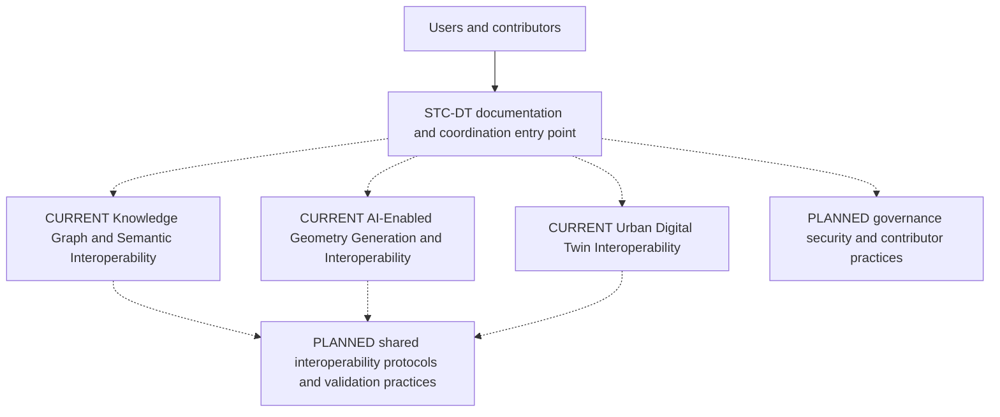

# Socio-Technical Cyberinfrastructure for Digital Twins (STC-DT)

STC-DT is an umbrella open-source ecosystem that provides a unified entry point to three independently maintained digital-twin research components.

1. Knowledge Graph / Semantic Interoperability
2. AI-Enabled Geometry Generation and Interoperability
3. Urban Digital Twin Interoperability

The repository gives users and contributors a common entry point and provides a foundation for future shared interoperability protocols, development practices, governance, security, contributor workflows, and long-term sustainability.

## Current state

**CURRENT:** The umbrella currently serves as a documentation and coordination entry point for independently maintained component repositories. It does not copy component source code, use Git submodules, or claim implemented cross-repository integration.

**PLANNED:** Contributors may establish shared terminology, interfaces, protocols, validation practices, governance, and security coordination through documented agreement and implementation evidence.

Dashed connections denote documentation relationships or planned work, not operational integration.

## Components

| Component                                           | Current status                                             | Repository                                                                                                                                    |
| --------------------------------------------------- | ---------------------------------------------------------- | --------------------------------------------------------------------------------------------------------------------------------------------- |
| Knowledge Graph / Semantic Interoperability         | Public open-source prototype; Apache-2.0; release `v0.1.0` | [Repository](https://github.com/halilyasavul/aec-knowledge-graph) · [Live demo](https://aec-knowledge-engine-16881077631.us-central1.run.app) |
| AI-Enabled Geometry Generation and Interoperability | Public research prototype; documentation and licensing are being finalized | [garfield](https://github.com/Ehs9449/garfield)                                                                                               |
| Urban Digital Twin Interoperability                 | Public open-source prototype; Apache-2.0; release `v0.1.0` | [Repository](https://github.com/vijaybkhot/urban-digital-twin-interoperability) · [Release](https://github.com/vijaybkhot/urban-digital-twin-interoperability/releases/tag/v0.1.0) · [Live demo](https://urban-digital-twin-interoperability.vercel.app/) |

Each independently maintained component retains its own licensing and release practices; the STC-DT umbrella repository itself is licensed under Apache-2.0.

See the [component registry](docs/components.md) for verified capabilities and explicit limitations.

## Documentation

- [Conceptual architecture](docs/architecture.md)
- [Component registry](docs/components.md)
- [Interoperability direction](docs/interoperability.md)
- [Ecosystem roadmap](docs/roadmap.md)
- [Contributing](CONTRIBUTING.md)
- [Security](SECURITY.md)
- [Code of Conduct](CODE_OF_CONDUCT.md)

Component implementation and component-specific issues remain in their respective repositories. STC-DT coordinates the ecosystem without replacing the components' technical identities or development processes.
