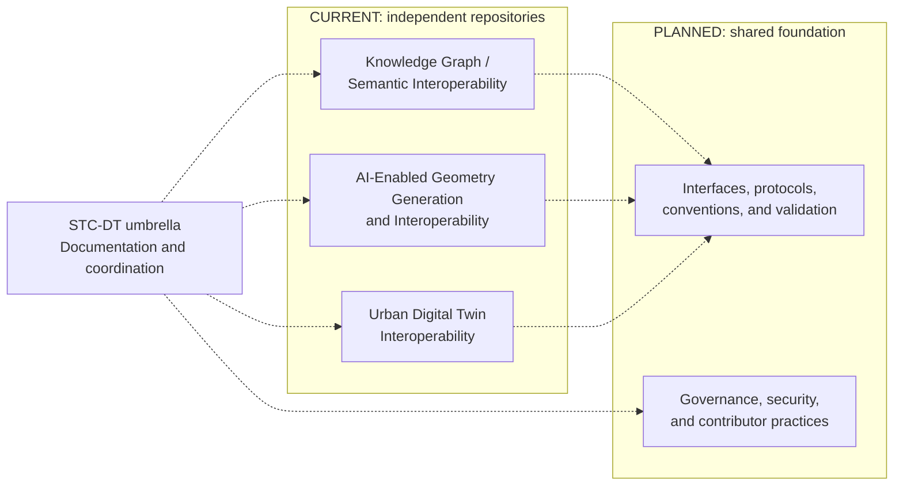

# Conceptual Ecosystem Architecture

## Purpose

STC-DT provides a conceptual framework for coordinating three independently maintained research components. This architecture is an ecosystem model for proposal and planning purposes, not a description of an implemented cross-repository system.

## Conceptual structure

The ecosystem has three levels:

1. **Independent component repositories**, each retaining its source code, technical scope, releases, and implementation decisions.
2. **The STC-DT umbrella**, providing shared navigation, documentation, coordination, and a place to record ecosystem decisions.
3. **A planned interoperability foundation**, through which contributors may define shared terminology, interfaces, protocols, governance, security practices, and validation methods.

Dashed connections represent documentation relationships or future design work. They do not represent working data exchanges or implemented dependencies.

## Current component boundaries

Within the Knowledge Graph component, IFC 4.3 information from bSDD JSON and EXPRESS sources is ingested into Neo4j. The component supports graph-grounded language-model interaction, UCKS entity capture and UCKS-to-IFC mapping, and XSD-validated buildingSMART IDS export. These are internal component capabilities and do not constitute implemented cross-component integration.

The AI-Enabled Geometry component currently provides an independently maintained research pipeline spanning COLMAP-based reconstruction, GARField and GARField-Gauss processing, feature clustering, SAM 3 semantic labeling, and semantic point-cloud generation. These are internal component capabilities and do not constitute umbrella-level integration.

The Urban Digital Twin component currently provides an independent research prototype with viewer-neutral domain contracts, a CesiumJS viewer boundary, local public-data processing, validated JSON and GeoJSON artifacts, and an isolated ArcGIS visualization-portability experiment. These are internal capabilities of that component and do not constitute umbrella-level integration.

## Architectural principles

### Independent ownership

Component implementation stays in component repositories. STC-DT does not duplicate source code or obscure responsibility for component-specific decisions.

### Explicit maturity

Documentation labels statements as current, proposed, planned, experimental, or pending confirmation. An interface is not shared merely because one component documents it.

### Minimal coupling

Future interoperability work should use explicit, reviewable boundaries rather than assumptions about internal component implementations.

### Traceable decisions

Cross-component terminology, protocols, and governance changes should record their rationale, status, participants, and affected components.

### Security and governance by design

Any future protocol should document data ownership, trust boundaries, access expectations, provenance, validation, versioning, and maintenance responsibility.

## Current limitations

No shared API, schema, exchange format, orchestration layer, deployment model, or cross-component workflow is documented as implemented across STC-DT.
